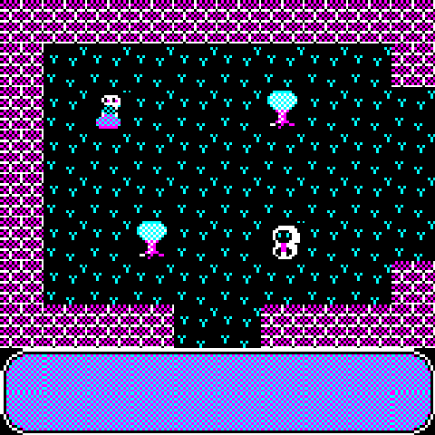

# dsekai

* [dsekai](#deskai)
  * [Roadmap](#roadmap)
  * [Documentation](#documentation)
* [Building](#building)
  * [Options](#options)
  * [Datafiles](#datafiles)
  * [Platforms](#platforms)
* [Modding](#modding)
  * [Mapping](#mapping)
  * [Skinning](#skinning)
  * [Scripting](#scripting)

dsekai is an extremely minimal world engine, intended to run on very old hardware. It is originally targeted to the 8086/8088 CPU with the intention to make it more portable later. See below for a list of supported platforms.

This project is being built around/in tandem with the unilayer project, in order to create a somewhat-universal framework/library for games on legacy/weird platforms.

There are also some rough examples of CGA graphics programming in unilayer/graphics/dosg.c, if that's what you're into.

## Roadmap

Features that are planned include:

* 256-Color graphics on some platforms while keeping 4-color/2-color support.
* Simple and consistent data structures for binary save dumps.
* Housing system based on in-game map editing.
* Item usage and crafting.
* Minimal resource use (shooting for <500k RAM).

Ideally, this engine will compile with legacy compilers as a general rule. For this reason, the following rules/limitations should be observed within the codebase:

* C should be limited to C89/ANSI C in general. No C99 features should be used. In some cases, not all ANSI features should be used.
* Except within platform-specific modules that can definitely handle it, dynamic allocation should also be avoided.
* Except within platform-specific modules that can definitely use them, external dependencies should be avoided.

In general, these restrictions are relaxed for items in the tools/ and check/ subdirectories (though these should also be limited to C89). For this reason, items in the src/ directory should also avoid depending on items in the tools/ and check/ directories (except for in platform-specific modules that do not have these restrictions that may use the tools/ subdirectory. Nothing should depend on the check/ subdirectory).

Items in the tools/ and check/ subdirectories may depend on the src/ directory freely.

## Documentation

Some attempt has been made at documentation with [doxygen](https://www.doxygen.nl/index.html). Simply run doxygen in the project root in order to generate HTML documentation under doc/.

This documentation is also available at [https://indigoparadox.github.io/dsekai/](https://indigoparadox.github.io/dsekai/).

This is a work in progress.

# Building

Currently, this project uses GNU make to (cross-)build on a GNU/Linux system. Compilers and tools required depend on the desired [platforms](#platforms) to build for.

For MS-DOS, the INCLUDE environment variable must be set to the location of the OpenWatcom header files (e.g. /opt/watcom/h).

## Options

The following options may be specified to make in order control the final output:

| Variable   | Options | Explanation
|------------|---------|-------------
| RESOURCE   | FILE    | Store assets as files in the filesystem.
|            | HEADER  | Store assets embedded in the binary.
| BIN_ASSETS |         | Specify path to load assets at runtime. Defaults to ../assets

## Datafiles

This engine should be capable of retrieving assets (levels, graphics, etc) from different locations, depending on how it was [built](#options). Aside from loading directly from the filesystem, it should be able to use OS-level resources embedded in the binary. On platforms without this facility, a rough approximation of this is emulated using [object embedding](headpack).

## Platforms

The following platforms are currently supported:

* **MS-DOS w/ CGA Graphics** (Maybe VGA graphics in the future...)
* **GNU/Linux with SDL** (May work with other POSIX platforms.)
* **Windows (16-bit/32-bit)**

The following platforms are planned to be supported but not yet functional:

* **PalmOS >= 3.5**
* **Mac-OS 6/7**
* **GNU/Linux with Xlib** (May work with other POSIX platforms.)
* **GNU/Linux with NCurses** (May work with other POSIX platforms.)
* **Nintendo DS**
* **WebASM/WebGL**

| Platform | Make Target         | Requirements |
|----------|---------------------|--------------
| MS-DOS   | bin/dsekai.exe   | [OpenWatcom](https://github.com/open-watcom/open-watcom-v2)
| SDL      | bin/dsekai       | SDL2
| Xlib     | bin/dsekaix      | Xlib
| \*PalmOS  | bin/dsekai.prc   | [PRCTools](https://github.com/jichu4n/prc-tools-remix)
| Win16    | bin/dsekai16.exe | [OpenWatcom](https://github.com/open-watcom/open-watcom-v2)
| Win32    | bin/dsekai32.exe | [OpenWatcom](https://github.com/open-watcom/open-watcom-v2)
| \*MacOS 7 | bin/dsekai16.dsk | [Retro68](https://github.com/autc04/Retro68)
| \*NDS     | bin/dsekai.nds   | [DevKitPro](https://devkitpro.org/)
| \*WebASM  | bin/dsekai.js    | emscripten
| \*Curses  | bin/dsekait      | NCurses

Platforms marked with * are currently broken.

Just doing "make" will attempt to build all currently working targets.

# Modding

## Mapping

Maps are stored as JSON files in the format used by the [Tiled](https://github.com/mapeditor/tiled) map editor.

Please see map_field.json in the assets directory for an example.

The following special considerations should be observed for the dsekai engine:

 * [Scripts](#scripting) are loaded from the map file according to the rules in that section.
 * NPC (or "mobile") spawns are stored in an objects layer called "objects". The engine selects the NPC sprite based on its name and its script based on a custom property called "script".
 * The static layer of the map is loaded from a layer called "terrain".

## Skinning

TBA

## Scripting

Scripts are stored in the [map](#mapping) files, under custom properties for the whole map labelled as "script_n", where n represents the index of the script as referred to by a mobile's script property.

Scripts are stored as sequences of a single character (shorthand for a statement) followed by a number (an argument).

Below is a brief overview of the mobile scripting language. All statements take
a single numerical (may be multiple digits) argument.

| Statement  | Char | Argument  | Explanation
|------------|------|-----------|-------------
| INTERACT   | i    |           | Jump to this step on player interaction.
| WALK_NORTH | u    | Steps     | Walk Steps north (up).
| WALK_SOUTH | d    | Steps     | Walk Steps south (down).
| WALK_EAST  | r    | Steps     | Walk Steps east (right).
| WALK_WEST  | l    | Steps     | Walk Steps west (left).
| SLEEP      | s    | Seconds   | Don't do anything for Seconds.
| START      | t    | Label_Num | Define a label index to jump to.
| GOTO       | g    | Label_Num | Jump to a defined label index.
| SPEAK      | p    | Text_Id   | Display Text_Id from the tilemap string table.
| RETURN     | x    |           | Return to PC previous to GOTO or interaction.

